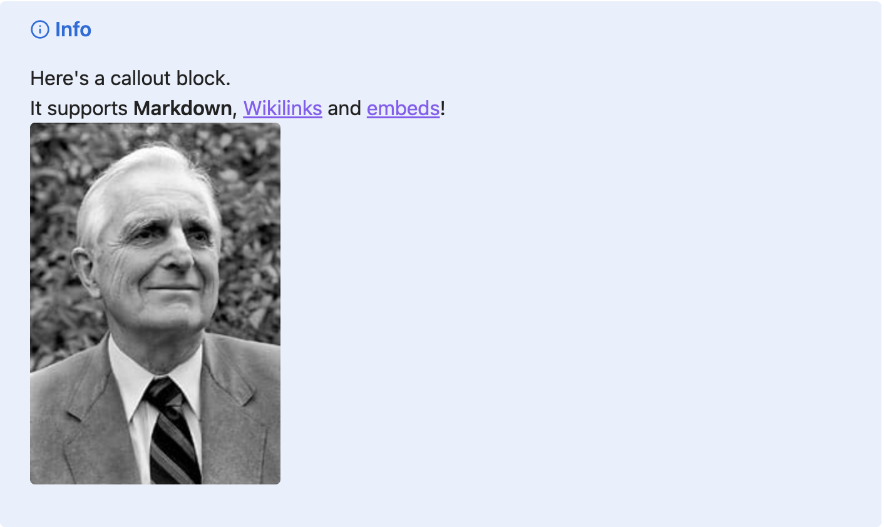

# markdown-obsidian-callouts

[](https://github.com/lextoumbourou/markdown-obsidian-callouts/actions/workflows/test.yml)

**[Python-Markdown](https://python-markdown.github.io/) Extension: use Obsidian Style callouts in Markdown**



This plugin inputs the Obsidian syntax and output format for [Callouts](https://help.obsidian.md/Editing+and+formatting/Callouts)

Originally a fork of [markdown-callouts](https://github.com/oprypin/markdown-callouts) but now a completely separate package. The major difference is that the output format no longer matches Admonitions.

## Installation

```shell
pip install markdown-obsidian-callouts
```

## Usage

### Using the Extension

To use the extension with Python-Markdown:

```python
import markdown

md = markdown.Markdown(extensions=['markdown_obsidian_callouts'])
html = md.convert('''
> [!note]
> This is a note callout
''')
```

### Add Packages Assets

This library also includes a CSS and JS asset, which are required to get the Obsidian-style callouts. There are two options for using these assets:

#### Option 1: Using Packaged Assets (Recommended)

The required CSS and JavaScript files are included with the package. You can access them programmatically:

```python
from markdown_obsidian_callouts import get_css_path, get_js_path

css_path = get_css_path()  # Returns path to the CSS file
js_path = get_js_path()    # Returns path to the JS file
```


#### Option 2: Using CDN

Alternatively, you can include the assets from a CDN:

```html
<link rel="stylesheet" href="https://cdn.jsdelivr.net/npm/markdown-obsidian-callouts@latest/assets/callouts.min.css">
<script src="https://cdn.jsdelivr.net/npm/markdown-obsidian-callouts@latest/assets/callouts.min.js"></script>
```

#### Install icons

Additionally, you'll need to include the Lucide icons library:

```html
<script src="https://unpkg.com/lucide@latest"></script>
<script>
    lucide.createIcons();
</script>
```

See [Lucide docs](https://lucide.dev) for more options.


## Development Setup

### Running tests

```shell
git clone https://github.com/lextoumbourou/markdown-obsidian-callouts
cd markdown-obsidian-callouts

uv venv
source .venv/bin/activate
uv pip install -e ".[dev]"

pytest
```

### Publishing

To publish updates to PyPI:

1. Ensure you have a PyPI account and the required tools:
2. Update the version in `pyproject.toml`
3. Build the package:

  ```bash
  python -m build
  ```

4. Upload to PyPI:

  ```bash
  python -m twine upload dist/*
  ```

  (API token is required)

### Building Assets

When assets are updated, the minified assets under `static` can be built as follows:

```bash
npm install -g postcss-cli cssnano terser

python scripts/build_assets.py
```

## License

This project is licensed under the MIT License - see the LICENSE file for details.
